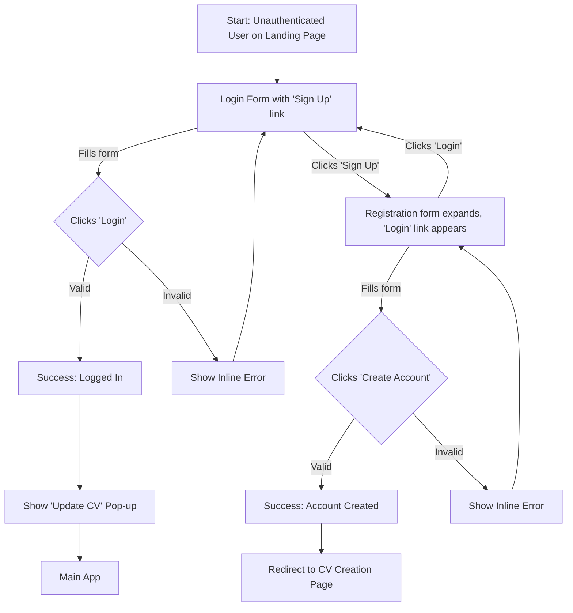

# ibe160 UX Design Specification

_Created on 2025-11-19 by BIP_
_Generated using BMad Method - Create UX Design Workflow v1.0_

---

## Executive Summary

CVAI Turbo is a web application designed to help university and college students overcome the difficulty of writing tailored cover letters. Students struggle to articulate their value to employers, costing them time and job opportunities. Our solution provides an AI-powered tool that takes a user's CV information and a job description, and automatically generates a relevant, high-quality cover letter. The MVP will focus on delivering this core functionality with a simple, text-based interface. The project's success will be measured by its ability to produce application-ready cover letters efficiently, with the ultimate goal of helping students secure employment more effectively. The ideal user experience is one of speed and empowerment.

---

## 1.0 Project and User Summary

### Project Vision:
CVAI Turbo is a web application designed to help university and college students overcome the difficulty of writing tailored cover letters. Students struggle to articulate their value to employers, costing them time and job opportunities. Our solution provides an AI-powered tool that takes a user's CV information and a job description, and automatically generates a relevant, high-quality cover letter. The MVP will focus on delivering this core functionality with a simple, text-based interface. The project's success will be measured by its ability to produce application-ready cover letters efficiently, with the ultimate goal of helping students secure employment more effectively. The ideal user experience is one of speed and empowerment.

### Target Users:
The primary users are university and college students, ranging from first-years looking for part-time work to graduating students who need to stand out in competitive career fields.

---

## 1. Design System Foundation

### 1.1 Design System Choice

The chosen design system is **Shadcn/UI**. This decision is based on its strong alignment with the project's needs for a clean, modern, and intuitive UI, its high customizability, excellent accessibility features, and seamless integration with Tailwind CSS and Next.js. Shadcn/UI, built on Radix Primitives, allows for full control over the code, enabling a bespoke design while leveraging proven component patterns.

---

## 2. Core User Experience

### 2.1 Defining Experience

The defining experience for CVAI Turbo is: "It's the app where you effortlessly generate a perfectly tailored cover letter for any job application."

### 2.2 Desired Emotional Response

Users should feel efficient and productive, connected and engaged.

### 2.3 Inspiration Analysis

The user provided two applications as inspiration: Jobseeker.com and CVmaker.no. The user finds these applications compelling because they are intuitive, easy to manage, and have a clean web-UI, which makes users feel productive and in control with minimal effort.

**Key UX Patterns Identified:**

*   **Two-Column Layout (Form + Live Preview):** Both applications feature a dominant two-column layout. The left side contains the input form with a text box where the user will copy/paste the job application description, while the right side provides a real-time preview of the final document. This pattern gives users immediate feedback, enhancing their sense of control and reducing the cognitive load of switching between editing and previewing.
*   **Clean, Minimalist UI:** The interfaces are characterized by ample white space, clear typography, and subtle visual cues. This contributes to a feeling of simplicity and makes the applications less intimidating to use.
*   **Progressive Disclosure:** Instead of presenting a long, overwhelming form, information is revealed progressively. Users can add fields or sections as needed, which simplifies the initial view and reduces friction.
*   **Clear Calls-to-Action:** Primary actions, such as downloading or saving, are visually distinct and easy to find.
*   **Component-Based Structure:** The forms are broken down into logical, manageable sections (e.g., Personal Information, Work Experience), making the information architecture intuitive.

These patterns directly contribute to the desired feeling of being "productive and in control with minimal effort."

### 2.4 Novel UX Patterns

For the MVP, the core user interactions (inputting text, triggering generation, displaying output) leverage established UX patterns such as forms, text areas, and clear call-to-action buttons. While the underlying AI-powered generation of tailored cover letters is a novel and powerful capability, it does not necessitate the design of entirely new user interaction patterns for the interface itself. The focus will be on optimizing these standard patterns for clarity, efficiency, and user control.

---

## 2.5 Core Experience Principles

*   **Responsive Feedback & Quality Generation:** The UI will provide immediate feedback for user actions. However, the core AI generation will prioritize producing a high-quality, relevant cover letter. The user will be kept informed during the generation process, but the emphasis is on the quality of the output, not just the speed of generation.
*   **Intuitive Guidance & Progressive Disclosure:** Provide just enough information at the right time, guiding users effortlessly without overwhelming them with choices.
*   **Empowering Simplicity:** Offer a streamlined experience that empowers users to achieve their goal with minimal complexity, while allowing for optional customization (e.g., through instructions for the AI).
*   **Clear & Affirming Feedback:** Provide immediate, understandable feedback for every action, celebrating success and clearly guiding through any issues.

---

## 3. Visual Foundation

### 3.1 Color System

The chosen color theme is **"The Innovator"**. This dark mode theme feels modern, engaging, and tech-forward, aligning with the AI-powered nature of CVAI Turbo and the desired emotional response of "connected and engaged."

**Palette:**
*   **Primary:** `#6A44E5` (Vibrant Purple) - For main actions, key interactive elements.
*   **Secondary:** `#4B5563` (Dark Grey) - For supporting elements, subtle backgrounds.
*   **Accent:** `#EC4899` (Pink) - For highlights, notifications, or secondary calls to action.
*   **Success:** `#10B981` (Green) - For positive feedback, successful operations.
*   **Error:** `#EF4444` (Red) - For critical alerts, error states.
*   **Background:** `#111827` (Dark Blue/Black) - Main background color.
*   **Text:** `#F9FAFB` (Off-White) - Primary text color for readability on dark backgrounds.

### 3.2 Typography System

To maintain a clean, modern, and professional aesthetic, a sans-serif font system will be used.

*   **Font Families:**
    *   Headings & Body: Inter (or a similar modern, highly legible sans-serif font like system-ui)
    *   Monospace: Fira Code (or a similar legible monospace font for code snippets or data display)
*   **Type Scale (Example):**
    *   H1: 2.5rem (40px)
    *   H2: 2rem (32px)
    *   H3: 1.75rem (28px)
    *   H4: 1.5rem (24px)
    *   Body: 1rem (16px)
    *   Small: 0.875rem (14px)
*   **Font Weights:** Regular (400), Medium (500), Semibold (600), Bold (700) - used judiciously to establish hierarchy.
*   **Line Heights:** 1.5 for body text to ensure optimal readability.

### 3.3 Spacing and Layout Foundation

A consistent, modular spacing system will be implemented to ensure visual harmony and responsiveness.

*   **Base Unit:** 4px (all spacing values will be multiples of this unit).
*   **Spacing Scale (Examples):** 4px, 8px, 12px, 16px, 20px, 24px, 32px, 48px, 64px.
*   **Layout Grid:** A standard 12-column grid system will be used for responsive layouts, providing flexibility across different screen sizes.
*   **Container Widths:** Content will be constrained within `max-width` containers to enhance readability on larger displays, with fluid adjustments for smaller viewports.

**Interactive Visualizations:**

- Color Theme Explorer: [ux-color-themes.html](./ux-color-themes.html)

---

## 4. Design Direction

### 4.1 Chosen Design Approach

The chosen design direction is a refined version of **Minimalist Preview (Direction #3)**, now designated as **Refined Minimalist (Direction #5)**. This direction emphasizes a clean, uncluttered interface, where the cover letter preview appears only after generation. A key refinement, based on user feedback, is the removal of the CV input field from this screen. Instead, the system will automatically utilize the user's single saved CV information from their profile. A clear indicator, 'Using your saved CV information. (Change/Edit CV)', will be present, with a link to the user's profile page for any modifications to their CV.

**Interactive Mockups:**

- Design Direction Showcase: [ux-design-directions.html](./ux-design-directions.html)

---

## 5. User Journey Flows

### 5.1 Critical User Paths

#### 5.1.1 User Onboarding (Registration & Login)

*   **User Goal:** To securely access the application.
*   **Entry Point:** Landing page.
*   **Chosen Approach:** Dynamic Toggle. A single page presents the login form by default, with a link to expand the form for registration. This provides a clean, modern, and seamless experience that prioritizes returning users while making registration easily accessible without a page reload.

**Flow Diagram:**



**Step-by-Step Flow:**

1.  **Initial View (Login):**
    *   **User Sees:** The landing page displays a clean form with fields for "Email" and "Password", a primary "Login" button, and a small text link below: "Don't have an account? **Sign Up**."
    *   **Interaction (Returning User):** The user enters their credentials and clicks "Login".
        *   *On Success:* The system authenticates the user and redirects them to the main application dashboard. A pop-up appears with the message "Welcome back! Would you like to update your CV information?" with "Update CV" and "Later" options.
        *   *On Failure:* An inline error message appears (e.g., "The email or password you entered is incorrect.") without a page reload. The form fields remain filled.

2.  **Toggle to Registration:**
    *   **Interaction (New User):** The user clicks the "**Sign Up**" link.
    *   **System Response:** The form container animates smoothly to reveal additional fields required for registration: "Name", "Date of Birth", "Gender", and "Phone Number". The primary button's text changes from "Login" to "Create Account", and the link below now reads: "Already have an account? **Login**."

3.  **Registration Submission:**
    *   **Interaction:** The user fills out the newly appeared fields. The system provides real-time inline validation where appropriate (e.g., checking for a valid email format).
    *   **Submission:** After filling the form, the user clicks "Create Account".
        *   *On Success:* The system creates the new user account, logs them in, and redirects them directly to a dedicated page to input their CV information for the first time.
        *   *On Failure (e.g., email already taken):* An inline error message appears explaining the issue. The user can correct the information and resubmit.

---

#### 5.1.2 CV Management

*   **User Goal:** To create, update, or view their CV information.
*   **Entry Point:**
    *   New users: Automatic redirect after registration.
    *   Returning users: From the post-login pop-up or a "Change/Edit CV" link.
*   **Chosen Approach:** Hybrid Save Model on a Single Scrolling Form. The system automatically saves changes when a user moves from one field to another, providing immediate feedback. A manual "Save" button is also present to give users a sense of finality and control.

**Flow Diagram:**

```mermaid
graph TD
    subgraph "CV Management Flow (Hybrid Save)"
        A[Start: User on CV Page] --> B[Form with 'Save' button (disabled)];
        B --> C[User clicks into a field];
        C --> D{Typing...};
        D --> E[Field border turns yellow, 'Save' enabled];
        E --> F{User leaves field (onBlur)};
        F --> G[Auto-save triggered];
        G -- Success --> H[Field border turns green];
        H --> I{All changes saved?};
        I -- Yes --> J['Save' button disabled, status 'All changes saved'];
        J --> B;
        I -- No --> B;

        E --> K[User clicks 'Save' button];
        K --> L[Manual save triggered];
        L -- Success --> M[All modified borders turn green, status 'All changes saved'];
        M --> J;
    end
```

**Step-by-Step Flow:**

1.  **Initial View:**
    *   **User Sees:** A single, scrolling form with dedicated text boxes for "Address", "Education", "Work Experience", "Qualifications", "Skills", and "Language". A status indicator at the top says "All changes saved". A "Save" button at the bottom is initially disabled.

2.  **Editing a Field:**
    *   **Interaction:** The user clicks into a text box and starts typing.
    *   **System Response:** The border of the active text box turns yellow. The status indicator at the top changes to "Unsaved changes...". The "Save" button at the bottom becomes enabled.

3.  **Auto-Saving:**
    *   **Interaction:** The user finishes editing a field and clicks or tabs to another part of the page.
    *   **System Response:** The system saves the change in the background. The yellow border of the just-edited field turns green. After a moment, the status indicator at the top updates to "All changes saved", and the "Save" button becomes disabled again.

4.  **Manual Saving:**
    *   **Interaction:** The user makes one or more changes (multiple yellow borders may be visible) and clicks the now-enabled "Save" button.
    *   **System Response:** All pending changes are saved. All yellow borders turn green. A confirmation message "Saved!" appears briefly, the main status indicator shows "All changes saved," and the "Save" button becomes disabled.

---
#### 5.1.3 Cover Letter Generation

*   **User Goal:** To generate a tailored cover letter for a specific job.
*   **Entry Point:** The main application screen after logging in and dismissing the optional "Update CV" pop-up.
*   **Chosen Approach:** A "Refined Minimalist" two-column layout with interactive inputs and a dedicated output panel. The flow incorporates guiding button states, versioned regeneration for comparison, and clear, multi-layered feedback on save actions.

**Flow Diagram:**

```mermaid
graph TD
    subgraph "Cover Letter Generation Flow"
        A[Start: Main Page] --> B{Job Description empty, 'Generate' disabled};
        B --> C[User pastes job description];
        C --> D['Generate' button enabled];
        D --> E{Clicks 'Generate'};
        E --> F[Right column shows loading spinner & message];
        F --> G{Generation complete};
        G --> H[Cover letter appears. 'Regenerate' & 'Save' buttons appear];
        H --> I{Clicks 'Save'};
        I --> J[Button becomes 'Saved ✓' & disabled. Toast notification appears];

        H --> K{Edits instructions};
        K --> L{Clicks 'Regenerate'};
        L --> M[Right column shows loading state];
        M --> N{New version generated};
        N --> O[Right column becomes tabbed: 'Version 2' (active), 'Version 1'];
        O --> H;
    end
```

**Step-by-Step Flow:**

1.  **Initial View:**
    *   **User Sees:** A two-column layout.
        *   **Left Column:** An indicator stating "Using your saved CV information. (Change/Edit CV)", a text area for "Job Description", a text area for "Optional instructions...", and a **disabled** "Generate Cover Letter" button.
        *   **Right Column:** A placeholder message, e.g., "Your generated cover letter will appear here."

2.  **Providing Input:**
    *   **Interaction:** User pastes text into the "Job Description" text area.
    *   **System Response:** The "Generate Cover Letter" button instantly becomes enabled.

3.  **Generation Process:**
    *   **Interaction:** User clicks the "Generate Cover Letter" button.
    *   **System Response:** The right column is replaced by a loading indicator. A spinner is displayed with the message "Please give us an A" periodically appearing below it. The input fields on the left are temporarily disabled to prevent changes during generation.

4.  **Reviewing Output:**
    *   **User Sees:** The loading indicator vanishes and is replaced by the generated cover letter text in the right column. In the left column, a "Regenerate" button appears. A "Save" button also appears, positioned logically near the output it controls.

5.  **Saving the Cover Letter:**
    *   **Interaction:** User clicks the "Save" button.
    *   **System Response:** The button's text immediately changes to "Saved ✓" and it becomes disabled. Simultaneously, a temporary notification ("toast") appears at the top of the screen stating, "Cover letter saved to your collection."

6.  **Regenerating for a Better Version:**
    *   **Interaction:** User adds or modifies text in the "Optional instructions..." area and clicks the "Regenerate" button.
    *   **System Response:** The generation process (Step 3) repeats. When the new letter is ready, the right column transforms into a tabbed interface. "Version 2" is the active tab, showing the new content. A "Version 1" tab is also present, allowing the user to easily compare the two. The "Save" button becomes enabled again for the new version.

## 6. Component Library

### 6.1 Component Strategy

The component strategy for CVAI Turbo is to primarily leverage the comprehensive and accessible components provided by **Shadcn/UI**, while creating a few key custom components to support the application's unique interactive features. This approach maximizes development speed and ensures a consistent, high-quality foundation, while allowing for bespoke elements that enhance the core user experience.

#### 6.1.1 Standard Components (from Shadcn/UI)

The following standard components from the Shadcn/UI library will be utilized for building the interface:

*   **Button:** For all primary, secondary, and tertiary actions (e.g., "Login", "Generate", "Save").
*   **Input:** For standard text entry fields in forms (e.g., Email, Password).
*   **Textarea:** For larger, multi-line text entry (e.g., "Job Description", "Optional instructions...").
*   **Card:** To structure and contain distinct sections of the UI.
*   **Tabs:** For switching between different versions of the generated cover letter.
*   **Toast:** For displaying non-intrusive notifications (e.g., "Cover letter saved").
*   **Link:** For navigation and informational links (e.g., "Sign Up", "Change/Edit CV").
*   **Form:** To manage form state and validation for login and registration.

#### 6.1.2 Custom Components

Two custom components will be developed to provide specific feedback and enhance the user experience in key flows.

**1. Stateful Textbox**

*   **Purpose:** To provide clear, immediate feedback on the auto-save status of a field within the CV Management form, ensuring the user always feels confident that their work is being saved.
*   **Content:** It will display the user-inputted CV information.
*   **User Actions:** Users can type, edit, and paste text into the component.
*   **States & Appearance:**
    *   **Default:** The component has a standard, neutral appearance, indicating no unsaved changes.
    *   **Typing/Unsaved:** When the user types or modifies text, the component's border will turn **yellow**. This visually communicates that changes have been made but are not yet persisted.
    *   **Saved:** After the user clicks the manual "Save" button, the border of all modified textboxes will turn **green**, confirming that the changes have been successfully saved.
*   **Variants:** A single, consistent style will be used for all instances of this component.

**2. Generation Status Indicator**

*   **Purpose:** To act as a responsive progress indicator during the AI generation process. It informs the user that the system is working on their request while injecting a moment of brand personality.
*   **Content:** The component will display a loading spinner. Periodically, the text message "Please give us an A" will appear alongside it for comedic effect.
*   **User Actions:** This is a non-interactive, display-only component. The user observes it while waiting for the generation to complete.
*   **States:**
    *   **Idle:** The component is not visible.
    *   **Generating:** The component is displayed, showing the active loading spinner and the intermittent message.
    *   **Complete:** The component is hidden, and the generated content is displayed in its place.
*   **Variants:** A single, consistent style will be used.

---

## 7. UX Pattern Decisions

### 7.1 Consistency Rules

### 7.1 Consistency Rules

To ensure a cohesive, intuitive, and predictable user experience across CVAI Turbo, the following UX pattern decisions will guide implementation:

#### 7.1.1 Button Hierarchy

*   **Primary Action:**
    *   **Usage:** The single most important action on a screen, guiding the user towards the main goal (e.g., "Generate Cover Letter", "Login", "Save").
    *   **Style:** Prominent, solid fill using the **Primary color (`#6A44E5`)**, with clear, contrasting text.

*   **Secondary Action:**
    *   **Usage:** Important but not primary actions, or alternative paths (e.g., "Regenerate", "Sign Up", "Cancel").
    *   **Style:** Less visually dominant than primary. An **outline button** using the Primary color, or a solid fill with a more subdued color like the **Secondary color (`#4B5563`)**.

*   **Tertiary Action:**
    *   **Usage:** Less critical actions, often supplementary or navigational (e.g., "Change/Edit CV" link, "Forgot Password").
    *   **Style:** Minimal visual weight, typically a **text-only link** or a subtle icon button.

*   **Destructive Action:**
    *   **Usage:** Actions that are irreversible or lead to data loss (e.g., "Delete Account", "Remove Item").
    *   **Style:** Clearly indicates danger, using the **Error color (`#EF4444`)**. This could be a solid fill or an outline.

#### 7.1.2 Feedback Patterns

*   **Success Feedback:**
    *   **Pattern:** **Toast notification.**
    *   **Usage:** For non-critical, temporary confirmations that an action was successful (e.g., "Cover letter saved"). Appears briefly and auto-dismisses.
    *   **Style:** Green background (Success color: `#10B981`), clear success icon, concise message.

*   **Error Feedback:**
    *   **Pattern:** **Inline error messages** for form validation, **Toast notifications** for general, non-blocking errors, and **Page-level error messages** for critical, blocking issues.
    *   **Usage:** Inline for field-specific validation; Toast for non-critical errors; Page-level for severe, blocking issues.
    *   **Style:** Red text (Error color: `#EF4444`) for inline. Red background for toast/page-level, with clear error icon and actionable message.

*   **Warning Feedback:**
    *   **Pattern:** **Toast notification** or **Inline warning message.**
    *   **Usage:** For non-critical alerts requiring user awareness but not immediate action.
    *   **Style:** Orange/Yellow background (Accent color: `#EC4899` or similar), with a warning icon and a clear message.

*   **Info Feedback:**
    *   **Pattern:** **Toast notification** or **Inline info message.**
    *   **Usage:** For general informational messages.
    *   **Style:** Neutral background (Secondary color: `#4B5563`), with an info icon and a concise message.

*   **Loading Feedback:**
    *   **Pattern:** **Spinner** for short waits, and **Skeleton loaders** for longer waits or content areas.
    *   **Usage:** Spinner for actions like "Generate Cover Letter" (using custom "Generation Status Indicator") or form submissions. Skeleton for fetching data for sections/pages.

#### 7.1.3 Form Patterns

*   **Label Position:**
    *   **Pattern:** **Above input field.**
    *   **Rationale:** Accessible and scannable, providing clear association between label and input.

*   **Required Field Indicator:**
    *   **Pattern:** **Asterisk (`*`) next to the label.**
    *   **Rationale:** Widely understood convention, supplemented by a note "Fields marked with * are required."

*   **Validation Timing:**
    *   **Pattern:** **On blur** for individual field validation, and **On submit** for overall form validation.
    *   **Rationale:** Provides immediate feedback proactively and catches remaining errors on submission.

*   **Error Display:**
    *   **Pattern:** **Inline error messages** below the field, and a **Form summary** at the top for multiple errors.
    *   **Rationale:** Directly points to problematic fields and provides an overview of all errors.

*   **Help Text:**
    *   **Pattern:** **Caption text** below the input field for persistent help, and **Tooltip** for contextual, on-demand help.
    *   **Rationale:** Caption for essential instructions, Tooltip for supplementary information.

#### 7.1.4 Modal Patterns

*   **Size Variants:**
    *   **Pattern:** **Small, Medium, and Large.**
    *   **Usage:** Small for simple confirmations; Medium for standard forms; Large for complex forms or content requiring more space.
    *   **Rationale:** Provides appropriate sizing for various use cases within the web application context (mobile development is post-MVP).

*   **Dismiss Behavior:**
    *   **Pattern:** **Click outside, Escape key, and Explicit close button (X icon).**
    *   **Rationale:** Multiple intuitive ways for users to dismiss, enhancing accessibility and user preference.

*   **Focus Management:**
    *   **Pattern:** **Auto-focus on the first interactive element within the modal.**
    *   **Rationale:** Improves accessibility and usability by immediately placing focus on the most likely interactive element, and traps focus within the modal.

*   **Stacking:**
    *   **Pattern:** **Avoid stacking multiple modals.** If a secondary action requires a modal, it should replace the current modal or be handled within the existing modal context. If a modal *must* trigger another, the new modal appears on top, temporarily obscuring the previous one, and returns to the previous modal upon its dismissal.
    *   **Rationale:** Prevents confusing and frustrating user experiences.

#### 7.1.5 Navigation Patterns

*   **Active State Indication:**
    *   **Pattern:** **Highlighting the active navigation item with a distinct background color and/or a bold text style.**
    *   **Rationale:** Provides clear visual feedback about the user's current location.

*   **Breadcrumb Usage:**
    *   **Pattern:** **Used for multi-level hierarchical content or complex workflows.**
    *   **Rationale:** Helps users understand their location in deep navigation structures and navigate back up.

*   **Back Button Behavior:**
    *   **Pattern:** **Primarily rely on the browser's back button.** An in-app "Back" button will only be used for specific, multi-step workflows where the browser back button might lead to unexpected behavior.
    *   **Rationale:** Leverages user familiarity with browser functionality, reserving in-app buttons for flow integrity.

*   **Deep Linking:**
    *   **Pattern:** **Support deep linking to all major application views and specific content where appropriate.**
    *   **Rationale:** Enhances shareability, bookmarking, and direct access to content, crucial for a web application.

#### 7.1.6 Empty State Patterns

*   **First Use:**
    *   **Pattern:** **Provide guidance and a clear Call-to-Action (CTA).**
    *   **Usage:** Guide users on how to populate a feature with no content.
    *   **Example:** On an empty "My Cover Letters" page, display a friendly illustration, a headline, a helpful message, and a primary button to "Generate New Cover Letter."

*   **No Results:**
    *   **Pattern:** **Provide a helpful message and suggest next steps.**
    *   **Usage:** Inform users when a search yields no results and offer ways to correct or broaden their search.
    *   **Example:** For no search results, display a headline, a helpful message suggesting checking spelling, and a "Clear Search" button.

*   **Cleared Content:**
    *   **Pattern:** **Confirm the action and provide an "Undo" option where feasible.**
    *   **Usage:** Confirm actions that result in an empty state and offer a way to reverse it.
    *   **Example:** After deleting the last cover letter, a Toast notification will pop up saying, "Cover letter deleted. **Undo**."

#### 7.1.7 Confirmation Patterns

*   **Delete Confirmation:**
    *   **Pattern:** **Always confirm with a modal, offering an "Undo" option via a Toast notification.**
    *   **Rationale:** Deletion is destructive; a modal ensures explicit confirmation, and "Undo" provides a safety net.

*   **Leave Unsaved Changes:**
    *   **Pattern:** **Warn with a custom modal if the user attempts to navigate away from a form with unsaved changes.** This modal will offer "Save," "Discard Changes," or "Cancel" options.
    *   **Rationale:** Prevents accidental data loss, building on the visual cues of the "Stateful Textbox."

*   **Irreversible Actions:**
    *   **Pattern:** **Require explicit user input (e.g., typing a specific word like "DELETE" to confirm) within a modal, in addition to a clear warning message.**
    *   **Rationale:** For highly sensitive actions, this higher level of confirmation prevents accidental execution.

#### 7.1.8 Notification Patterns

*   **Placement:**
    *   **Pattern:** **Top-right corner of the viewport.**
    *   **Rationale:** Common, unobtrusive, and easily discoverable without blocking critical content.

*   **Duration:**
    *   **Pattern:** **Auto-dismiss after 5-7 seconds for informational and success messages; manual dismiss for errors and warnings.**
    *   **Rationale:** Balances user flow with the need for acknowledgment of critical messages.

*   **Stacking:**
    *   **Pattern:** **New notifications appear above existing ones, pushing older notifications down.**
    *   **Rationale:** Ensures the most recent information is immediately visible, with a maximum limit to prevent clutter.

*   **Priority Levels:**
    *   **Pattern:** **Critical (Error), Important (Warning), and Informational (Success/Info).**
    *   **Rationale:** Differentiates messages by urgency and required user attention, using distinct visual cues.

#### 7.1.9 Search Patterns

*   **Trigger:**
    *   **Pattern:** **Manual trigger (on 'Enter' key press or explicit search button click).**
    *   **Rationale:** Simpler to implement for MVP and provides clear user control.

*   **Results Display:**
    *   **Pattern:** **Display results within the current view after the manual trigger.**
    *   **Rationale:** Minimizes navigation complexity, showing filtered content directly.

*   **Filters:**
    *   **Pattern:** **Inline filters, appearing as dropdowns or checkboxes, positioned above or to the side of the search results.**
    *   **Rationale:** Easily discoverable and allows users to refine search without navigating away.

*   **No Results:**
    *   **Pattern:** **Provide a helpful message and suggestions for refining the search.**
    *   **Rationale:** Guides users when a search yields no results, suggesting alternatives.

#### 7.1.10 Date/Time Patterns

*   **Format:**
    *   **Pattern:** **Primarily use absolute date/time format (e.g., "November 20, 2025, 10:30 AM").**
    *   **Rationale:** Provides precision and clarity for professional documents and activity tracking.

*   **Timezone Handling:**
    *   **Pattern:** **Display dates and times in the user's local timezone.**
    *   **Rationale:** Most user-friendly approach, aligning with immediate user context.

*   **Pickers:**
    *   **Pattern:** **Text input for date entry, with a simple calendar dropdown for selection if a date picker is required.** For time, a simple dropdown or direct input.
    *   **Rationale:** Provides flexibility for typing and visual aid for picking, leveraging standard Shadcn/UI components.

---

## 8. Responsive Design & Accessibility

### 8.1 Responsive Strategy

### 8.1 Responsive Strategy

For the MVP, the primary focus is on the **desktop/web application**. Mobile and tablet development, along with full screen reader support, are planned for post-MVP.

*   **Target Devices:** Desktop/Web application only for MVP.
*   **Breakpoints:**
    *   A single primary breakpoint will be used for the desktop web application. The layout will be designed to be robust and visually appealing across common desktop monitor sizes. Content will be constrained within `max-width` containers to enhance readability on very large displays.
*   **Adaptation Patterns:**
    *   **Layout:** The 12-column grid system will be utilized for flexible layouts that scale horizontally on desktop.
    *   **Navigation:** Primary navigation (e.g., sidebar or top navigation) will be designed specifically for the desktop web experience.
    *   **Content:** Tables, forms, and other content will be optimized for desktop screen real estate.

### 8.2 Accessibility Strategy

*   **WCAG Compliance Target:** **WCAG 2.1 Level A.**
    *   **Rationale:** Given the MVP focus and the decision to defer full screen reader support, targeting Level A is a pragmatic starting point. This ensures basic accessibility, addressing fundamental barriers, while allowing us to focus on core functionality. Level AA and full screen reader support will be targeted post-MVP.
*   **Key Requirements (focused on Level A for MVP):**
    *   **Color Contrast:** Ensure sufficient contrast for text and essential UI components.
    *   **Keyboard Navigation:** All interactive elements must be reachable and operable using only the keyboard.
    *   **Focus Indicators:** Visible focus states on all interactive elements (buttons, links, form fields).
    *   **Form Labels:** Ensure all form inputs have properly associated labels.
    *   **Error Identification:** Clear, descriptive error messages.
    *   **Semantic HTML:** Use appropriate HTML5 semantic elements to convey structure and meaning.
    *   **Alt Text:** Provide descriptive `alt` text for all meaningful images (where applicable and feasible within MVP scope).
*   **Testing Strategy (MVP):**
    *   **Automated Tools:** Integrate tools like Lighthouse (built into Chrome DevTools) and axe DevTools into the development workflow.
    *   **Manual Testing:** Conduct thorough keyboard-only navigation testing.

---

## 9. Implementation Guidance

### 9.1 Completion Summary

**Completion Summary:**
Excellent work! Your UX Design Specification is complete.

**What we created together:**

-   **Design System:** We've chosen **Shadcn/UI** as our foundation, complemented by two custom components: the **Stateful Textbox** for intuitive CV management and the **Generation Status Indicator** for engaging feedback during cover letter creation.
-   **Visual Foundation:** We've established "The Innovator" color theme, paired with **Inter/Fira Code** typography and a precise **4px spacing system**, creating a modern and cohesive look.
-   **Design Direction:** Our core application layout and interaction will follow the **"Refined Minimalist"** direction, prioritizing clarity and efficiency.
-   **User Journeys:** We've meticulously designed three critical user flows: **User Onboarding (Registration & Login), CV Management, and Cover Letter Generation**, ensuring a smooth path for users.
-   **UX Patterns:** We've defined comprehensive consistency rules across **10 categories**, including Button Hierarchy, Feedback, Forms, Modals, Navigation, Empty States, Confirmations, Notifications, Search, and Date/Time, to guarantee a predictable and intuitive experience.
-   **Responsive Strategy:** For the MVP, our focus is exclusively on the **desktop/web application**, with mobile and tablet development planned for post-MVP.
-   **Accessibility:** We're targeting **WCAG 2.1 Level A compliance** for the MVP, ensuring basic accessibility while deferring full screen reader support to post-MVP.

**Your Deliverables:**
-   UX Design Document: `docs/ux-design-specification.md`
-   Interactive Color Themes: `docs/ux-color-themes.html`
-   Design Direction Mockups: `docs/ux-design-directions.html`

**What happens next:**
-   Designers can create high-fidelity mockups from this foundation.
-   Developers can implement with clear UX guidance and rationale.
-   All your design decisions are documented with reasoning for future reference.

You've made thoughtful choices through visual collaboration that will create a great user experience. Ready for design refinement and implementation!

---

## Appendix

### Related Documents

- Product Requirements: `{{prd_file}}`
- Product Brief: `{{brief_file}}`
- Brainstorming: `{{brainstorm_file}}`

### Core Interactive Deliverables

This UX Design Specification was created through visual collaboration:

- **Color Theme Visualizer**: {{color_themes_html}}
  - Interactive HTML showing all color theme options explored
  - Live UI component examples in each theme
  - Side-by-side comparison and semantic color usage

- **Design Direction Mockups**: {{design_directions_html}}
  - Interactive HTML with 6-8 complete design approaches
  - Full-screen mockups of key screens
  - Design philosophy and rationale for each direction

### Optional Enhancement Deliverables

_This section will be populated if additional UX artifacts are generated through follow-up workflows._

<!-- Additional deliverables added here by other workflows -->

### Next Steps & Follow-Up Workflows

This UX Design Specification can serve as input to:

- **Wireframe Generation Workflow** - Create detailed wireframes from user flows
- **Figma Design Workflow** - Generate Figma files via MCP integration
- **Interactive Prototype Workflow** - Build clickable HTML prototypes
- **Component Showcase Workflow** - Create interactive component library
- **AI Frontend Prompt Workflow** - Generate prompts for v0, Lovable, Bolt, etc.
- **Solution Architecture Workflow** - Define technical architecture with UX context

### Version History

| Date     | Version | Changes                         | Author        |
| -------- | ------- | ------------------------------- | ------------- |
| 2025-11-19 | 1.0     | Initial UX Design Specification | BIP |

---

_This UX Design Specification was created through collaborative design facilitation, not template generation. All decisions were made with user input and are documented with rationale._
